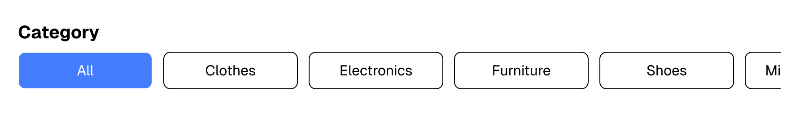

# 🛍️ Next.js Product Listing App

Aplikasi katalog produk sederhana menggunakan **Next.js** , **TailwindCSS**, dan [Fake Store API (escuelajs)](https://api.escuelajs.co/).

# Try Commerce

E-commerce simple project built with Next.js.

🔗 **Live Demo**: [try-commerce-five.vercel.app](https://try-commerce-five.vercel.app)

---

## ✨ Fitur

- Menampilkan produk dari API
- Infinite scroll (Load More)
- Filter berdasarkan rentang harga
- Gambar dengan fallback otomatis
- Responsif dan minimalis

---

## 📸 Tampilan

### 🏠 Beranda


### 🔍 Detail Produk


### 🧹 Produk Tidak Ditemukan


### 🧹 Default Picture


### 🧭 Filter Kategori


### ♻️ Infinite Pagination


---

## 🚀 Cara Menjalankan Project

### 1. Clone Repo

```bash
https://github.com/erikasempana/try-commerce.git
cd try-commerce
```

### 2. Install Dependencies

```bash
npm install
# atau
yarn install
```

### 3. Jalankan di Lokal

```bash
npm run dev
# atau
yarn dev
```

Akses `http://localhost:3000`.

---

## 🛠️ Build Production

```bash
npm run build
npm start
```

Atau deploy ke [Vercel](https://vercel.com).

---

## 🔧 Konfigurasi Gambar

```js
// next.config.mjs
const nextConfig = {
  images: {
    remotePatterns: [
      {
        protocol: 'https',
        hostname: 'placehold.co',
      },
      {
        protocol: 'https',
        hostname: 'i.imgur.com',
      },
      {
        protocol: 'https',
        hostname: 'placeimg.com',
      },
      {
        protocol: 'https',
        hostname: 'static6.depositphotos.com',
      },
      {
        protocol: 'https',
        hostname: 'example.com',
      },
      {
        protocol: 'https',
        hostname: 'test.com',
      },
      {
        protocol: 'https',
        hostname: 'pravatar.cc',
      },
    ],
  },
};

export default nextConfig;
```

---

## 📁 Struktur Folder

```
/src
  /app
    page.js
/components
```

---

## 🙋‍♀️ Dibuat Oleh

> Dibuat dengan penuh semangat oleh **Erika Sempana**  
> _“A mini showcase project to explore Next.js 14 & Tailwind.”_
